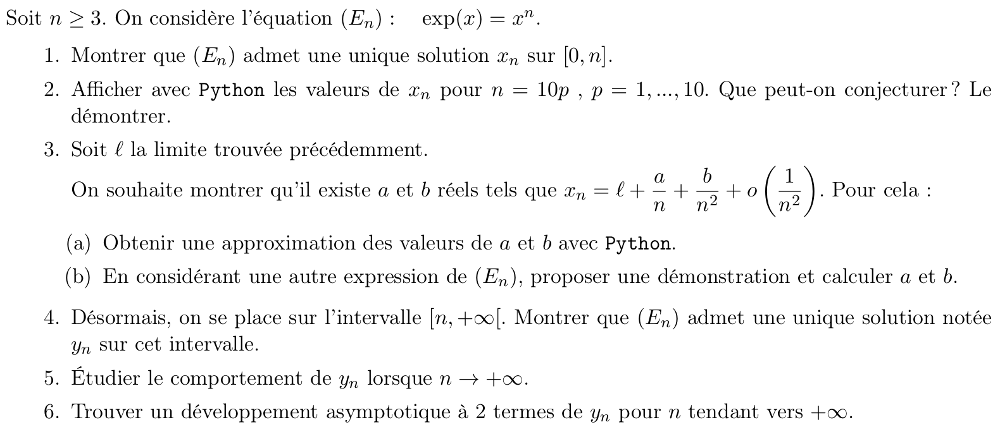

Dans ce TP, vous pouvez soit vous entraîner sur un sujet d'oral Centrale (conseillé mais un peu difficile - posez-moi des questions!) ou de l'ancien concours ENSAM (si les sujets Centrale sont trop difficiles).

# Oral math-info à Centrale

À l'oral du concours Centrale, il y a une épreuve de math-info (Mathématiques 2). Voici un extrait du rapport :
> **Mathématiques 2 (avec Python)**  
> Chaque épreuve consiste en un exercice unique, en général volontairement long. Signalons cependant qu’il
> n’est nullement nécessaire de résoudre l’exercice en totalité pour obtenir une excellente note. Le candidat
> dispose d’une demi-heure de préparation pendant laquelle il a un accès libre à Python. Pendant la demi-
> heure suivante, les résultats obtenus sur ordinateur sont discutés, tandis que la résolution des questions
> théoriques se fait au tableau. L’usage des outils informatiques est présent dans la totalité des sujets et
> une question est systématiquement placée vers le début de l’énoncé à cet effet.
> Les seules connaissances exigibles sont celles du programme officiel d’informatique des classes prépara­
> toires. Des documents d’aide (sous forme papier et numérique), fournis à tous les candidats et librement
> téléchargeables sur le site du concours Centrale-Supélec, présentent les fonctions des bibliothèques numpy,
> scipy et matplotlib qui pourront être utiles sans pour autant être exigibles. L’évaluation tient alors
> compte de la capacité des candidats à s’approprier ces éléments, puis d’en analyser les résultats. Dans
> tous les cas, outre la maitrise des connaissances théoriques, l’examinateur prend grandement en compte
> dans son évaluation la qualité de communication du candidat.

La page https://www.concours-centrale-supelec.fr/CentraleSupelec/SujetsOral/MP regroupe des exemples de sujets ainsi que des documents donnés aux candidats pendant la préparation :

> Le jury attend que les candidats soient familiarisés avec l'utilisation de Python (la distribution Pyzo est disponible sur les ordinateurs mis à disposition des candidats) et de ses bibliothèques numpy, scipy et matplotlib. Cependant, aucune connaissance de fonctions particulières n'est exigée ; les candidats auront à disposition, pendant l'épreuve, des documents listant un certain nombre de fonctions qui peuvent être utilisées pour résoudre les exercices proposés. Ces documents sont disponibles ci-dessous et couvrent la majorité des exercices, des indications complémentaires pourront figurer dans les sujets.

Exercices à faire :

- https://www.concours-centrale-supelec.fr/CentraleSupelec/SujetsOral/PSI/2015-057-PSI-Mat2.pdf
- https://www.concours-centrale-supelec.fr/CentraleSupelec/SujetsOral/PC/2015-026-PC-Mat2.pdf
- https://www.concours-centrale-supelec.fr/CentraleSupelec/SujetsOral/MP/2015-016-MP-Mat2.pdf

# Oral info à l'ENSAM

https://www.e3a-polytech.fr/wp-content/uploads/2019/12/oral_math_exo_types.pdf
